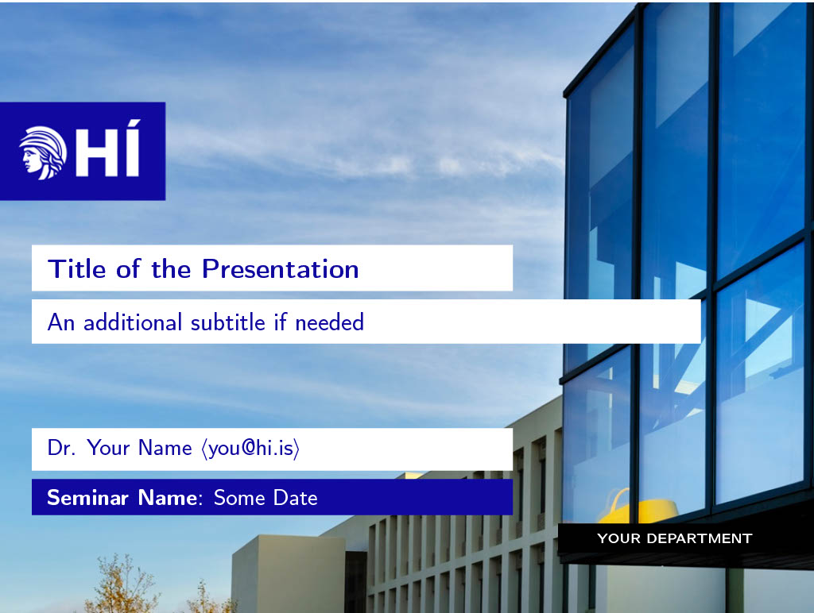
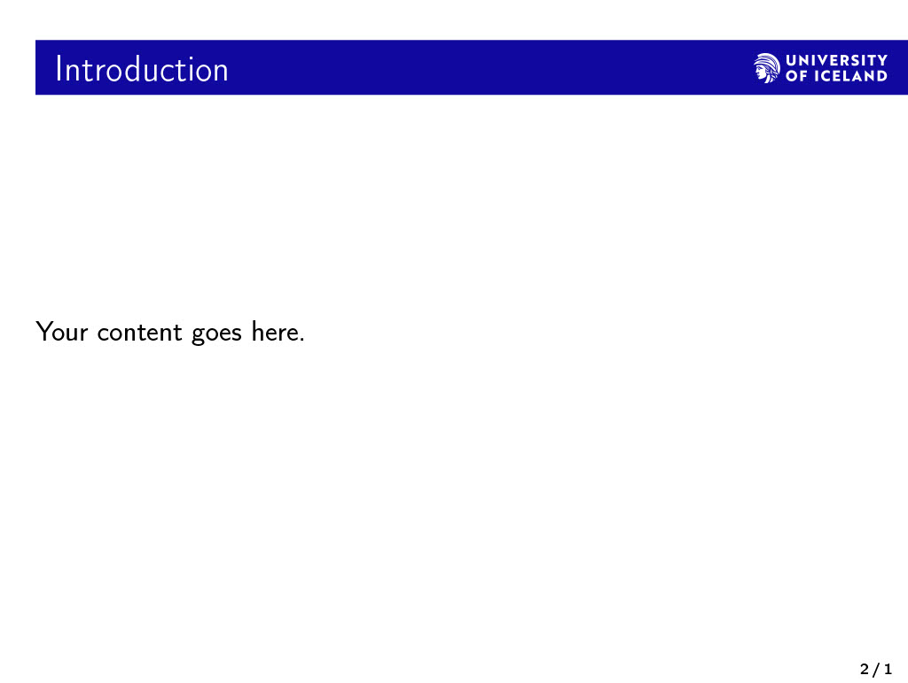

# Beamer slides for the University of Iceland
This LaTeX class provides a custom Beamer theme for presentations related to the University of Iceland. You can easily set various parameters, including the title, author details, faculty name, seminar name, email, and more.

## Configuration Parameters
The `hi-beamer` class offers a variety of parameters to customize your presentation:

### Required
The following variables are mandatory to be set:
* `NAME`: Name of the presenter.
* `TITLE`: Title of the presentation.
* `FACULTY`: Faculty or department associated with the presentation.
* `SEMINAR`: Name or title of the seminar or event.
* `EMAIL`: Email of the presenter.

### Optional
* `SUBTITLE`: Subtitle of the presentation. Default is empty.
* `DATE`: Date of the presentation. Default is the current date (`\today`).
* `WIDE`: To use a widescreen 16:9 aspect ratio, set this parameter to true. By default, the aspect ratio is 4:3.
* `ICELANDIC`: Toggle for Icelandic vs English logos. Set to true for Icelandic. Default is false, which uses the English version.

## Example Usage
Below is a generic example showing how to use this class:

```latex
\documentclass[
    NAME={Dr. Your Name},
    EMAIL={you@hi.is},
    FACULTY={Your Department},
    TITLE={Title of the Presentation},
    SUBTITLE={An additional subtitle if needed},
    SEMINAR={Seminar Name},
    DATE={Some Date}
]{hi-LaTeX-slides/hi-beamer}

\begin{document}

\begin{frame}{Introduction}
    Your content goes here.
\end{frame}

\end{document}
```
Please make sure that the repository or directory `hi-LaTeX-slides` is accessible from the location of your `.tex` file.

The above example will produce the following slides:





## Using this Class in Your LaTeX Document

For easy integration, it's recommended to add this repository as a **submodule** in your project:

1. Navigate to your project's root directory in the terminal or command prompt.

2. Run the following command to add the `hi-LaTeX-slides` repository as a submodule:
   ```bash 
   git submodule add git@github.com:tungufoss/hi-LaTeX-slides.git hi-LaTeX-slides
   ```
3. To initialize, fetch and checkout the submodule, use:
   ```bash 
    git submodule update --init
   ```
4. When you clone your project repository later or if someone else clones your project, make sure to use the 
   `--recurse-submodules` option with `git clone` to ensure the submodule content is fetched too:
   ```bash 
    git clone --recurse-submodules git@github.com/YourUserName/YourProjectRepo.git
   ```

5. If you want to pull the latest changes from the `hi-LaTeX-slides` submodule later, navigate to the submodule directory and pull the changes:
    ```bash 
    cd hi-LaTeX-slides
    git pull origin main
    ```

## Source
This theme is built upon [this design guideline from the University of Iceland](https://honnun.hi.is/5afb7ec03/p/654569-powerpoint-kynningar)
and [Dr. Benedikt Magnússon](https://github.com/benediktmag/hi-latex-slides)'s slide template on [overleaf](https://www.overleaf.com/latex/templates/hi-latex-slides/mpydjfsfmdcc).

## Feedback & Contributions
For any feedback, issues, or contributions, please submit a pull request or open an issue on this GitHub repository.

## License
The contents of this repository are open-source. Please refer to the LICENSE file for more information.
